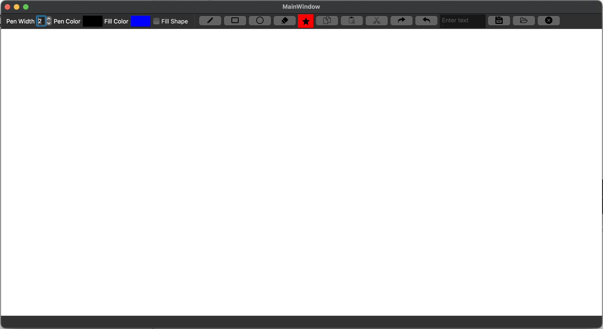

# IRO Paint - Paint Program

## Table of contents:
- [Introduction](#introduction)
- [Project Features](#project-features)
- [Project Structure](#project-structure)
- [Quick Preview](#quick-preview)
- [Examples](#examples)
- [How to Run The Project](#run-the-project)
- [Team](#team)

### Introduction
Qt C++ Desktop application Paint program that allows user to draw basic shapes like Rectangles, lines, circles and some file manager options.

### Project Features
- Draw Shapes (Rectangles, Lines, Circles, Free Drawing)
- Color Picker (Choose color from the color wheel)
- Fill Shapes (Fill shapes with color)
- Stroke Shapes (Change stroke width & color)
- Save as PNG (Save painting as PNG file)
- Save your work (Save painting file)
- Load your work (Load painting file)
- Undo/Redo (Undo/Redo your last actions)

### Project Structure

The project is built using:
Qt Version: 6.15.2
- Frontend:
  - Qt C++
  - Qt Designer
  - Qt Creator
  - CSS
- Backend:
  - C++
  - Qt Creator

```
master
├─  Docs (doxygen)
├─  PainterAPP
├─  UML (UML Diagrams)
├─  README.md   
└─  .gitignore
```

### Quick Preview
1- Application Review
 


### How to Run The Project
1. Download Qt & Qt Creator from [here](https://www.qt.io/download)
1. Clone the repository
2. Open the project file in Qt Creator (PaintFigure.pro)
3. Build the project
4. Run the project

As simple as that!


### Team
Project on QT and C++ - Data Structures class project created by:

- [Soufiani]
- [Djamel]
- [Chrinbou]


### Submitted to:
- Mr.Dennis Reant 
  All rights reserved © 2024 - Datascientest
