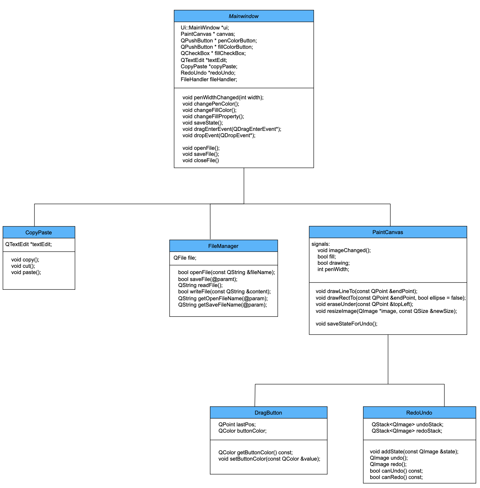

# PainterAPP - Programme de Peinture

## Table des matières :
- [Introduction](#introduction)
- [Fonctionnalités du Projet](#fonctionnalités-du-projet)
- [Structure du Projet](#structure-du-projet)
- [Aperçu Rapide](#aperçu-rapide)
- [Exemples](#exemples)
- [Comment Exécuter le Projet](#comment-exécuter-le-projet)
- [Équipe](#équipe)

### Introduction
Application de bureau Qt C++ permettant à l'utilisateur de dessiner des formes de base comme des rectangles, des lignes, des cercles et quelques options de gestion de fichiers.

### Fonctionnalités du Projet
- Dessiner des formes (Rectangles, Lignes, Cercles, Dessin Libre)
- Sélecteur de couleur (Choisir une couleur à partir de la roue chromatique)
- Remplir des formes (Remplir les formes avec de la couleur)
- Tracer des formes (Changer la largeur et la couleur du trait)
- Enregistrer le fichier
- Sauvegarder votre travail (Enregistrer le fichier de peinture)
- Charger votre travail (Charger le fichier de peinture)
- Annuler/Rétablir (Annuler/Rétablir vos dernières actions)

### Structure du Projet

Le projet est construit en utilisant :
Version de Qt : 6.15.2
- Frontend :
  - Qt C++
  - Qt Creator
- Backend :
  - C++
  - Qt Creator
master
├─  Docs (doxygen)
├─  PainterAPP
├─  UML (Diagrammes UML)
├─  README.md
└─  .gitignore

### Aperçu Rapide
1- Classe  Diagram

2- Revue de l'application  

### Comment Exécuter le Projet
1. Téléchargez Qt & Qt Creator depuis [ici](https://www.qt.io/download)
2. Clonez le dépôt
3. Ouvrez le fichier du projet dans Qt Creator
4. Construisez le projet
5. Exécutez le projet

### Équipe
Projet sur QT et C++ - Projet de la classe de structures de données créé par :

- [Soufiani]
- [Djamel]
- [Chrinbou]

### Soumis à :
- M. Dennis Reant  
  Tous droits réservés © 2024 - Datascientest

